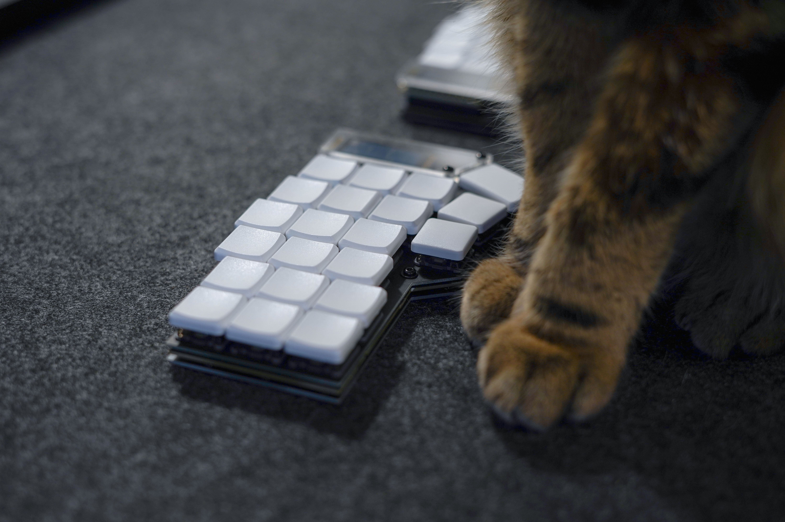
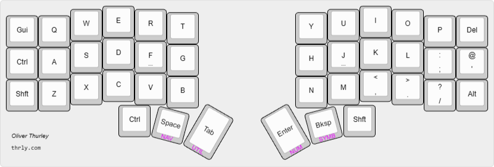
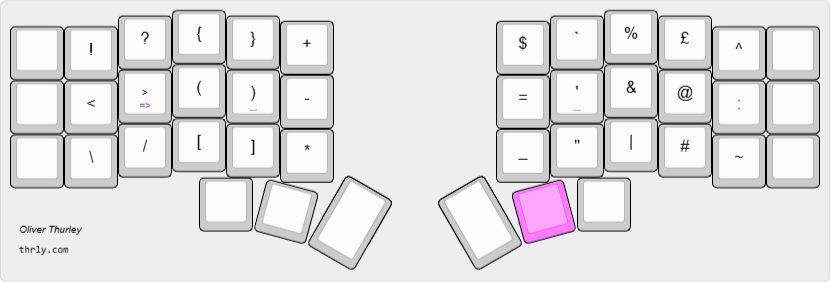
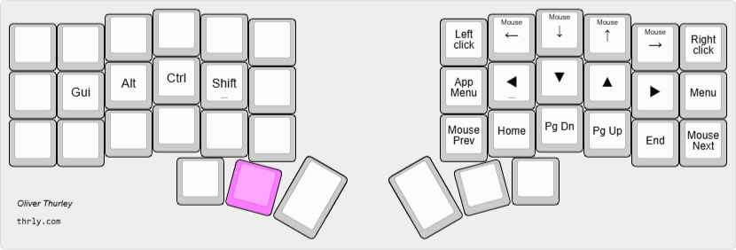
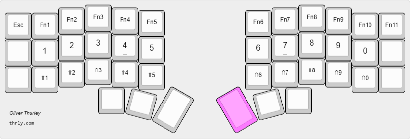

# thrly's ZMK configuration

> This config is for a 6-col corne (wireless version from [Typeractive](https://typeractive.xyz/)), but I'm gradually trying to wittle it down to a smaller 36-key 5-col...

For more explanations and reflections on this customization, see [my blog post](https://thrly.com/blog/thoughts-on-customising-a-split-keyboard-layout/) on this keymap.

## Key Features

- QWERTY alpha layout
- Homerow mods ([balanced flavour](https://zmk.dev/docs/keymaps/behaviors/hold-tap#option-3-balanced)) - `Gui-Alt-Shf-Ctl`
- Sticky shift
- Mouse behavior on Nav layer
- Horizontal Num layer
- Thumb keys transparent on layers (for `Ctrl` and `Shift`)
- Combos:
  - volume (outer right top + middle / middle + bottom)
  - caps word / caps lock (`G`+`J` / `T`+`Y`)
  - escape (`Q`+`W`)
  - delete (`O`+`P`)
- double-tap `>` for `=>` arrow

## Layers

Note that in the current keymap diagrams, the homerow mods (Gui-Alt-Shf-Ctl) are not currently shown.

### Base layer

### Symbol layer

### Nav layer

.
### Num layer

## Dependencies

https://github.com/M165437/nice-view-gem
~https://github.com/urob/zmk-helpers~ (temporarily depreciated)
~https://github.com/urob/zmk-config~ (temporarily depreciated)

## Notes

- Configure keymap with https://nickcoutsos.github.io/keymap-editor/
- Flash firmware from latest 'Actions' artifact
